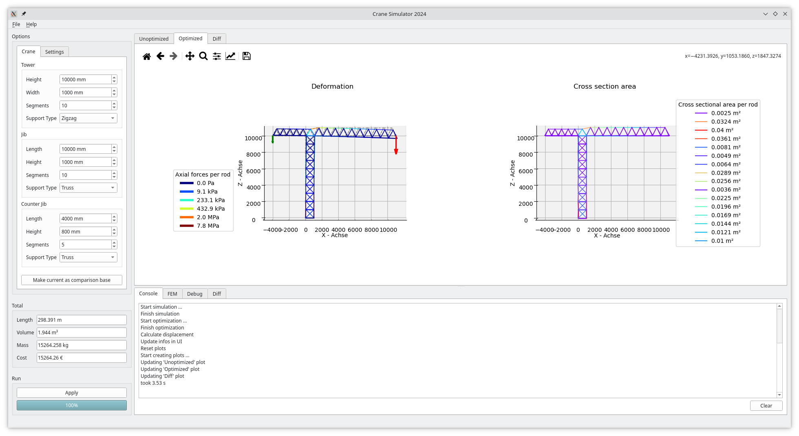

# Crane Simulator 2024



This program was developed through a project course at the Technical University of Darmstadt.

The task was to develop a tower crane using FEM simulation and to further customize it using parameters.
Our simulation is limited to a highly abstracted version of a tower crane, which is only assembled by simple rods.
Except for the forces weights on the booms, gravity and a horizontal force, which can be considered as a strong
simplification of the wind. No other influences from reality are considered.

## Goals

According to our own requirements, the software should meet the following points

* Create fast and easy new construction cranes
* Simulate your design in different scenarios
* Optimize newly created designs
* Share your design with others

## Quick start

Download the current release for your platform if available. Otherwise, build it your self, follow the instruction
below.

To get started, run your executable. Once done click on **File > Open** and select the file ``exampleCrane.xml``. This
contains an example configuration of the options, which can be set under **Options** can be set.

## Build yourself

Make sure all required packages are installed. Keep in mind that the development branch is unstable at all time. 
Therefore, it is recommended to use the master branch, which is updated after each new stable release.

```
build-essential cmake extra-cmake-modules qtbase5-dev qtdeclarative5-dev qtquickcontrols2-5-dev libkf5i18n-dev gettext libkf5coreaddons-dev libkf5xmlgui-dev libkf5textwidgets-dev libkf5kio-dev libvtk9-dev libvtk9-qt-dev xtensor-dev libxtensor-dev
```
Afterwards run the following commands: 
```
cmake -B build/
cmake --build build/
```

Run executable in ``build/`` to launch the program

## Licence

This source code is licenced under the [GNU GPLv3](LICENCE.md) license.


